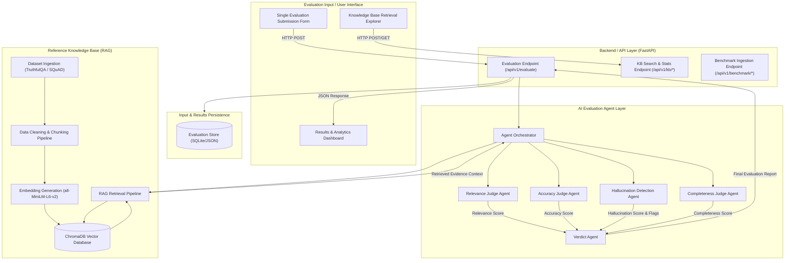
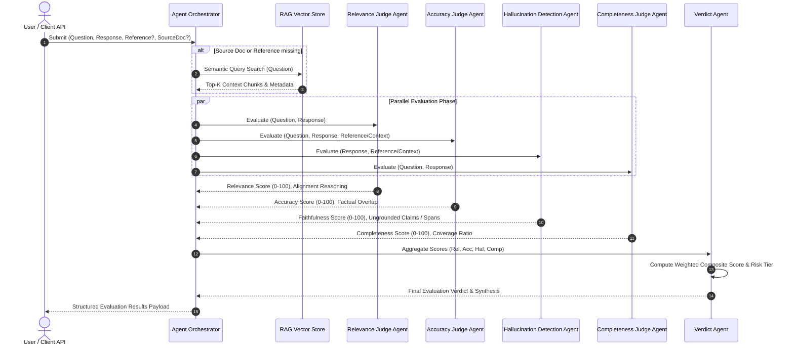

# Milestone 1 System Architecture & Multi-Agent Specification (M1.2)

## 1. System Architecture Overview



---

## 2. Multi-Agent Layer Responsibilities



### Agent Detailed Specifications

#### 1. Agent Orchestrator
- **Responsibility**: Manages state, pipeline routing, optional RAG context retrieval triggering, parallel dispatch to judge agents, and passing outputs to the Verdict Agent.
- **Inputs**: `question`, `ai_response`, `reference_answer` (optional), `source_document` (optional).
- **Behavior**: If reference answer or source document are absent, invokes RAG retrieval on the Reference Knowledge Base to supply context.

#### 2. Relevance Judge Agent
- **Responsibility**: Evaluates query-response intent alignment, semantic closeness, and checks for topic drift or question-deafness.
- **Output**: `score` (0–100), `explanation`, `question_intent`, `is_on_topic` (boolean).

#### 3. Accuracy Judge Agent
- **Responsibility**: Evaluates factual correctness against ground-truth reference answers or retrieved benchmark context.
- **Output**: `score` (0–100), `explanation`, `matched_facts`, `contradicted_facts`.

#### 4. Hallucination Detection Agent
- **Responsibility**: Analyzes statement-level faithfulness and identifies ungrounded assertions, entity mismatches, or fabricated details unsupported by source text or retrieved context.
- **Output**: `faithfulness_score` (0–100), `hallucination_risk` ("Low", "Medium", "High"), `flagged_claims` (list of text spans with ungrounded explanations).

#### 5. Completeness Judge Agent
- **Responsibility**: Evaluates whether all key aspects, sub-questions, and implicit prompt requirements are answered.
- **Output**: `score` (0–100), `explanation`, `covered_aspects`, `missing_aspects`.

#### 6. Verdict Agent
- **Responsibility**: Combines all four agent outputs into a unified composite evaluation verdict, determines overall status (`PASS`, `NEEDS_REVIEW`, `FAIL`), calculates overall score, and generates human-readable executive feedback.

---

## 3. Scoring Methodology & Formulas

### Metric Weighting System
The overall composite score $S_{\text{overall}} \in [0, 100]$ is computed as a weighted combination of the individual agent dimension scores:

$$S_{\text{overall}} = w_r \cdot S_{\text{relevance}} + w_a \cdot S_{\text{accuracy}} + w_h \cdot S_{\text{hallucination}} + w_c \cdot S_{\text{completeness}}$$

Default Weights:
- $w_h$ (**Hallucination / Faithfulness**): `0.35` (35%)
- $w_a$ (**Accuracy**): `0.25` (25%)
- $w_r$ (**Relevance**): `0.20` (20%)
- $w_c$ (**Completeness**): `0.20` (20%)

### Verdict Classification & Thresholds

| Overall Score Range | Hallucination Risk | Final Verdict | Action Recommendation |
| :--- | :--- | :--- | :--- |
| **85.0 – 100.0** | LOW | `PASS` | Safe for deployment; high accuracy & faithfulness. |
| **60.0 – 84.9** | MEDIUM | `NEEDS_REVIEW` | Minor gaps or ungrounded claims; human review suggested. |
| **0.0 – 59.9** | HIGH | `FAIL` | Significant hallucination or irrelevance; reject response. |

> **Special Penalty Override**: If the Hallucination score drops below `40.0` (severe hallucination detected), the final verdict is automatically forced to `FAIL` regardless of high relevance or completeness scores.

---

## 4. End-to-End Data Flow Architecture

```
[ User Input Submission ]
       │
       ▼
┌────────────────────────────────────────────────────────┐
│ Input Processing & Validation Module                  │
│ • Validate required fields (question, ai_response)      │
│ • Sanitize input strings                               │
│ • Generate unique submission ID                        │
└────────────────────────────────────────────────────────┘
       │
       ▼
┌────────────────────────────────────────────────────────┐
│ Context Resolution (RAG Pipeline)                       │
│ • Check if user provided source_document or reference  │
│ • If absent: Embed question -> Query ChromaDB          │
│ • Retrieve Top-K benchmark context chunks & metadata    │
└────────────────────────────────────────────────────────┘
       │
       ▼
┌────────────────────────────────────────────────────────┐
│ Multi-Agent Evaluation Layer                           │
│ • Dispatch to Relevance, Accuracy, Hallucination,      │
│   and Completeness Judge Agents                        │
│ • Collect dimension sub-scores & reasoning             │
└────────────────────────────────────────────────────────┘
       │
       ▼
┌────────────────────────────────────────────────────────┐
│ Verdict Synthesis & Score Aggregation                  │
│ • Calculate weighted composite score                   │
│ • Assign Risk Tier (LOW / MEDIUM / HIGH)              │
│ • Apply penalty overrides                              │
│ • Generate executive summary feedback                 │
└────────────────────────────────────────────────────────┘
       │
       ▼
┌────────────────────────────────────────────────────────┐
│ Result Persistence & Response Delivery                 │
│ • Persist evaluation snapshot to SQLite/JSON database │
│ • Return structured JSON payload to client UI          │
└────────────────────────────────────────────────────────┘
```
